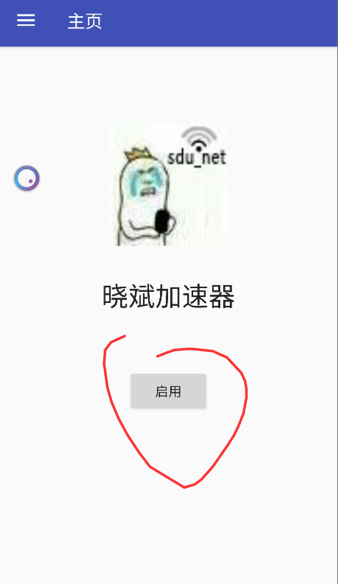
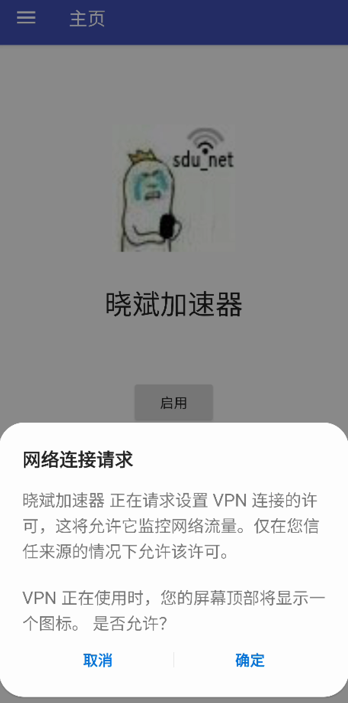
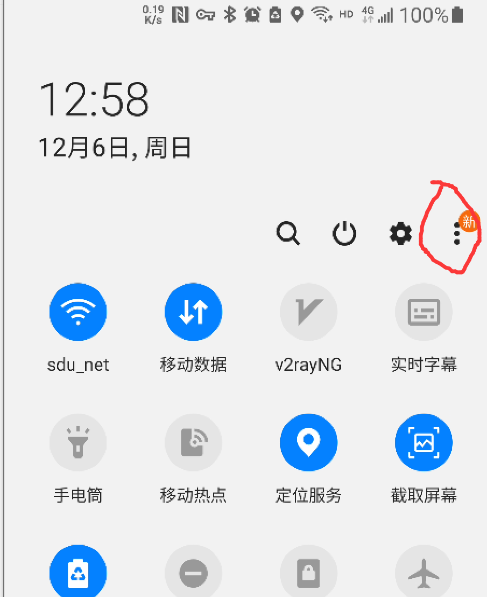
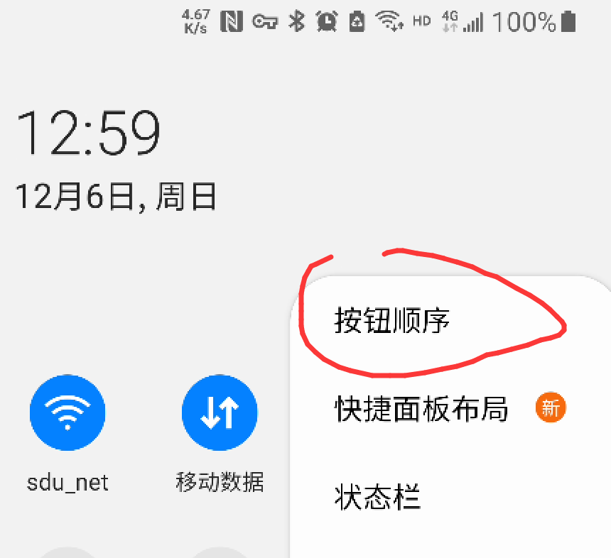
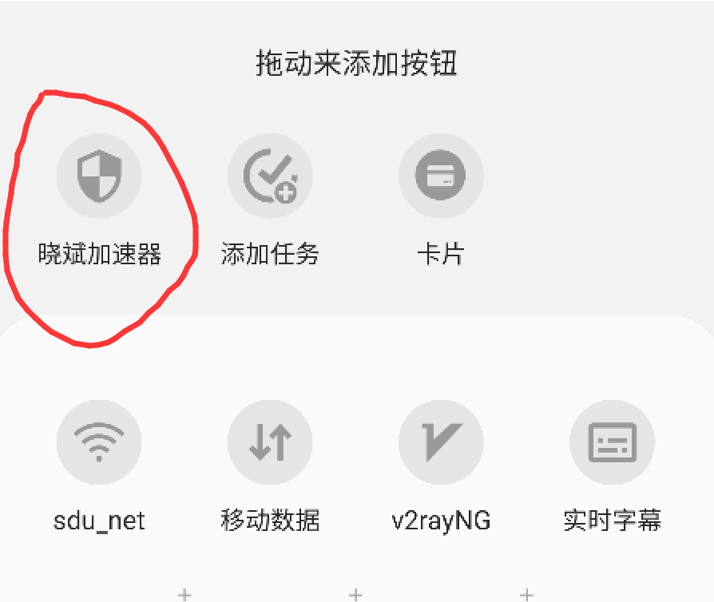
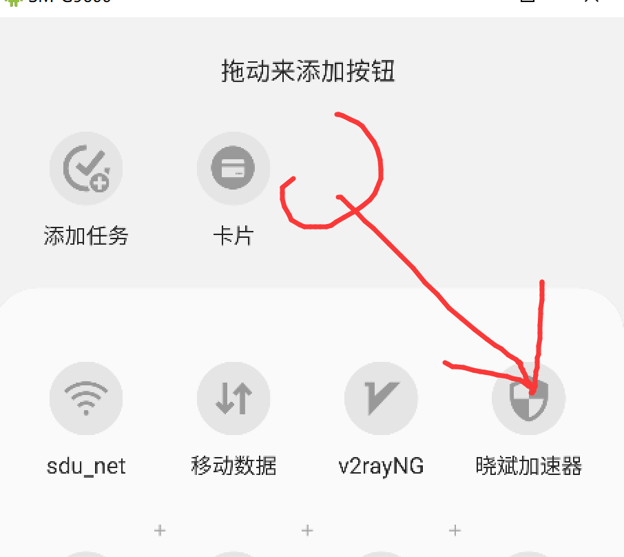
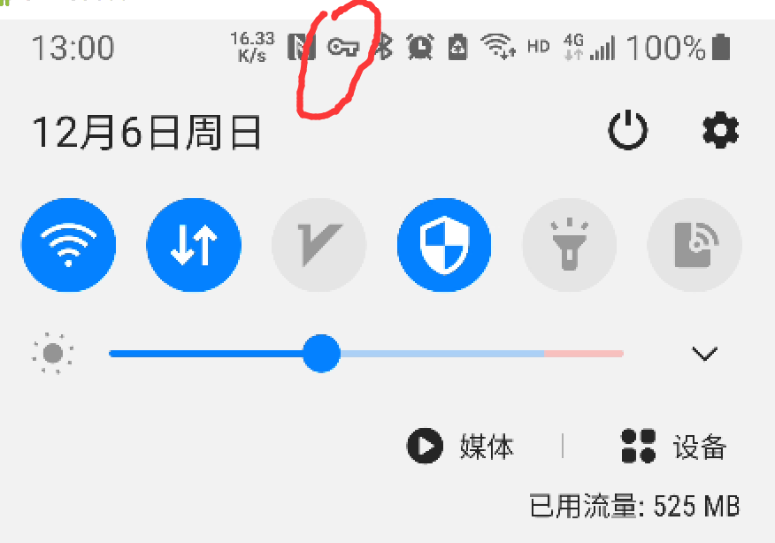
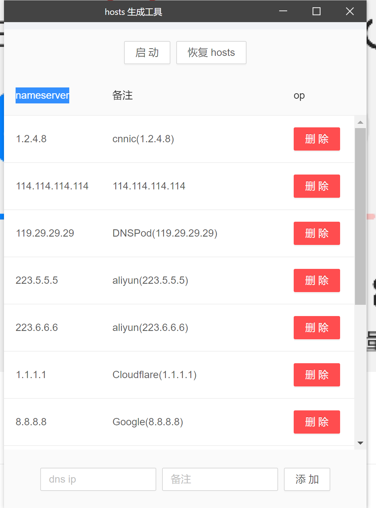

# simple_dns_test

## 安卓使用方法:

以三星为例

### 方法1: 主界面点开即用

### 方法二:添加到快捷栏菜单

#### 注意 使用快捷栏之前要主页面启动一次拿到授权

安装软件后会发现下拉菜单右边有三个点

拖下来就能用了

有小锁头就是启动成功了

## pc使用方法

首先安装 WinPcap.exe

然后安装PC-Client.exe

直接点启动就行了

你之前的hosts文件会被备份到hosts.bak

按回复hosts来将自己的hosts恢复到之前的样子